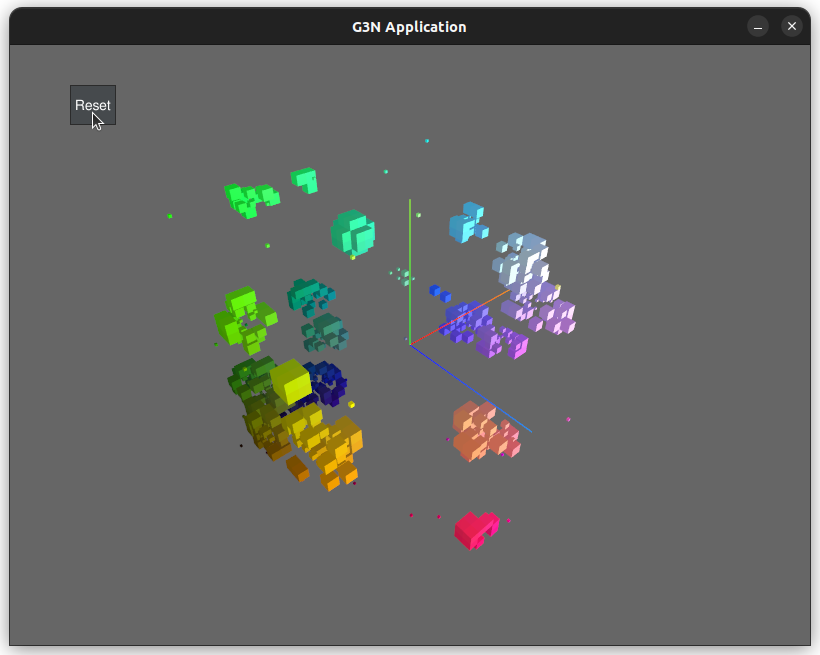

# gocellular
3d cellular automata with a GUI in GO!

## Desciption
Made using G3N Game Engine

Automata rules are defined by: survival / spawn / states / neighbour

### GUI:

### TODO:
- [x] Create README
- [ ] Fill in TODO list

### For more info on 3D cellular automata:
- https://en.wikipedia.org/wiki/Cellular_automaton
- https://softologyblog.wordpress.com/2019/12/28/3d-cellular-automata-3/
