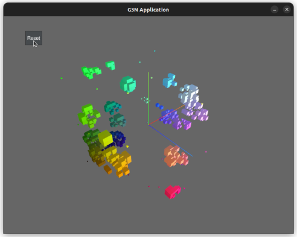

# gocellular

3d cellular automata with a GUI in GO!

## Desciption

Made using [G3N Game Engine](https://github.com/g3n/engine)

### Usage

Change constants at the top of `main.go` then `go run main.go`

*note: board of 45 by 45 by 45 uses aprox 1Gb of VRAM, do not run big scenes w/o a graphics card*

### GUI

- Click and drag to **rotate**
- Right click and drag to **move**
- Mouse wheel or middle button and drag  to **zoom**
- Reset button creates a new random initialization

### Rules

Automata rules are defined by: survival / spawn / states / neighbour

Some examples:

#### 3D Brain (Jason Rampe)

Rule: /4/2/M

#### 445 (Jason Rampe)

Rule: 4/4/5/M

#### Clouds 1 (Jason Rampe)

Rule: 13-26/13-14,17-19/2/M

### TODO

- [x] Create README
- [x] Fill in TODO list
- [x] Add rules to readme
- [x] Add gif to readme
- [x] Make multithreaded
- [ ] Use a faster game engine engine

### For more info on 3D cellular automata

- <https://en.wikipedia.org/wiki/Cellular_automaton>
- <https://softologyblog.wordpress.com/2019/12/28/3d-cellular-automata-3/>
